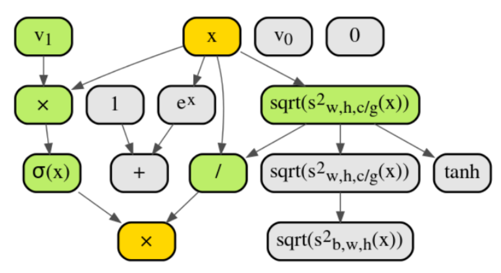
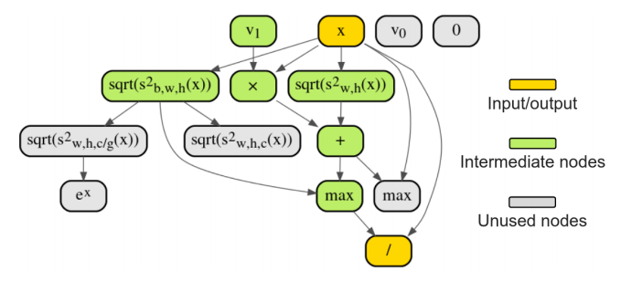

# TF2-EvoNorm

This repository implements candidates BO and SO defined in
[Evolving Normalization-Activation Layers](https://arxiv.org/pdf/2004.02967.pdf) in TensorFlow 2.0.

## EvoNorm S0

## EvoNorm B0

